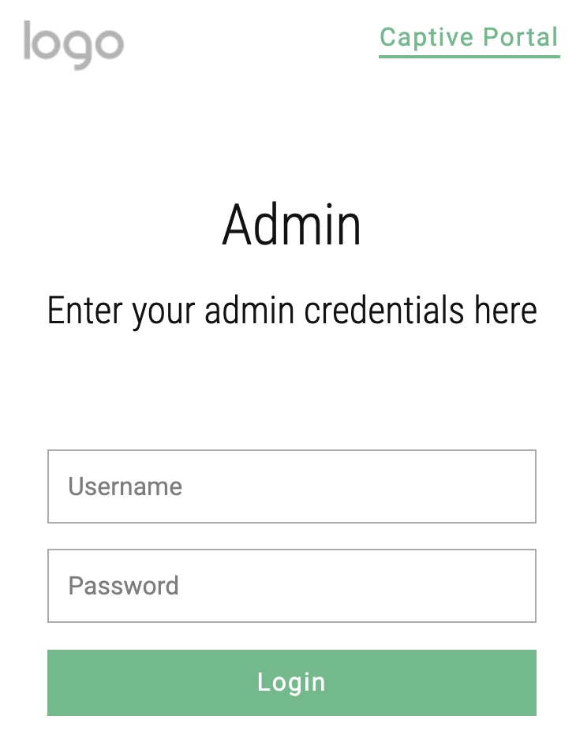

# Meraki External Captive Portal 

The External Captive portal will allow you to authenticate users against MySQL database and assign group policy based on their membership levels stored in the database against the user. The below instructions are based on Ubuntu server.

</img>

### Configuration

Here is the YouTube link for the implmentation steps [here](https://www.youtube.com/watch?v=LtmaSYwjaP4).

#### Obtain Meraki API key

Meraki API write Key is needed to allow the transfer of the configuration. Obtain Meraki API key [here](https://developer.cisco.com/meraki/api/#!authorization/obtaining-your-meraki-api-key).

#### Create Meraki Group Policy

Create Meraki Group policies and make sure the name matches what will be configured in the database against each user. Details of creating group policy can be found [here](https://documentation.meraki.com/General_Administration/Cross-Platform_Content/Creating_and_Applying_Group_Policies)

### Installation

#### Getting started
- Update Ubuntu packages
    ```bash
    $ sudo apt update
    ```
- Install python3 pip package
    ```bash
    $ sudo apt install python3-pip
    ```

#### Install MySQL Database
- Install MySQL packages
    ```bash
    $ sudo apt install mysql-server
    ```
- Edit mysqld.cnf file (change the bind-address from 127.0.0.1 to 0.0.0.0)
    ```bash
    $ sudo nano /etc/mysql/mysql.conf.d/mysqld.cnf
    ```
- Restart the MySQL service
    ```bash
    $ sudo systemctl restart mysql
    ```
- Add admin user to allow remote access to the database
    ```bash
    $ sudo mysql
    $mysql> GRANT ALL PRIVILEGES ON *.* TO 'admin'@'%' IDENTIFIED BY 'Password' WITH GRANT OPTION;
    $mysql> FLUSH PRIVILEGES;
    ```
    
#### Installing the Captive Portal App
- Install the libraries required
    ```bash
    $ sudo pip3 install -r requirements.txt
    ```
- Allow admin access to the Captive Portal Repo
    ```bash
    $ sudo chmod 777 ../Meraki_Captive_Portal
    $ sudo chmod -R a+rw ../Meraki_Captive_Portal
    ```
- Run the app
    ```bash
    $ python3 app.py
    ```
    
### Use

- From any browser enter http://ip_address:5000 or http://localhost:5000
- Choose Admin from top right corner

</img>

- Enter username: admin, Password: admin
- Provide the details and hit save
- Go back to Captive Portal page
- Enter any username and password to allow the script build the database
- Login to Database via MySQLWorkbench. Download [here](https://dev.mysql.com/downloads/workbench/)
- Add users in Captive table inside the database
